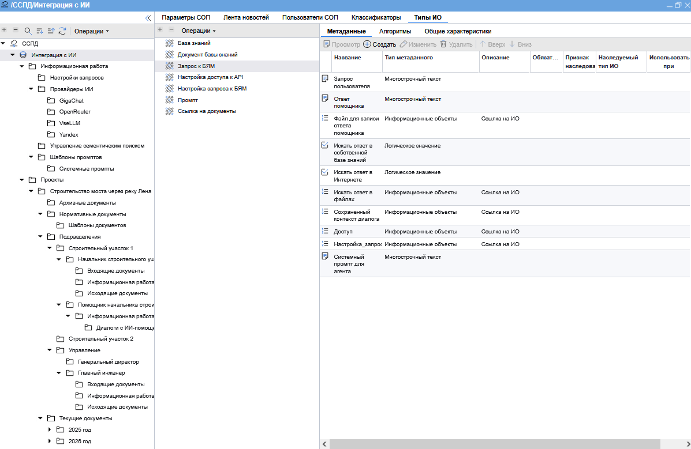
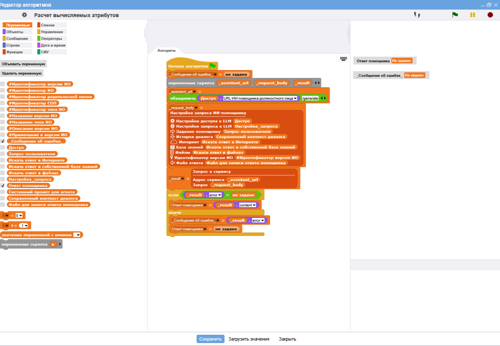
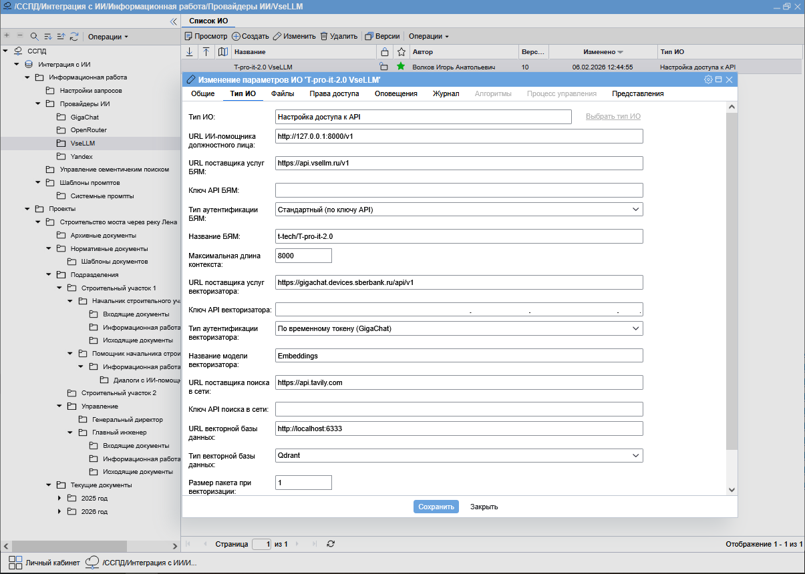
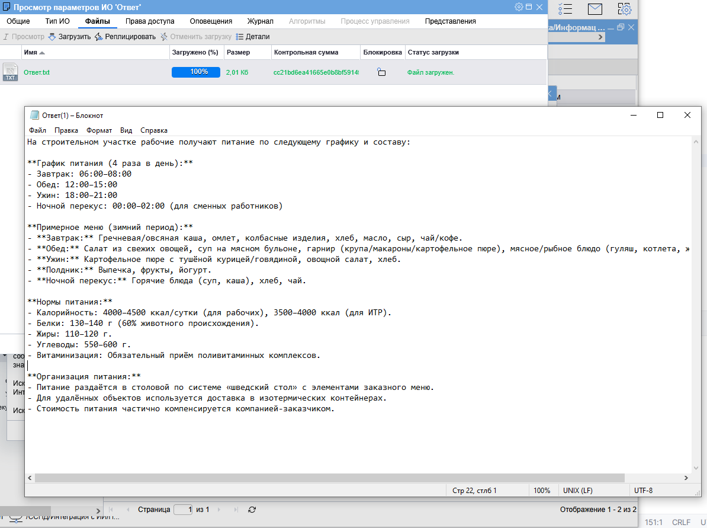

№# Интеграция ИИ-помощника должностного лица с корпоративным файловым обменником (KFO Plus AI) 
Проект объединяет несколько специализированных модулей для создания интеллектуальной системы обработки документов с использованием RAG (Retrieval-Augmented Generation) и агентных технологий.

## 📋 Описание проекта

KFO Plus AI — это комплексное решение для интеллектуальной обработки документов, которое включает:

- **Интеллектуальный чанкинг документов** с сохранением иерархической структуры
- **RAG-систему** для поиска и извлечения информации из базы знаний
- **Агентную систему** с Schema-Guided Reasoning для рассуждений и планирования
- **Интеграцию с корпоративным файловым обменником** средствами low-code оркестратора

## Пример настройки ИИ-помощника ## 

## Пример работы с ИИ-помощником ##

## Презентация проекта

## 🏗️ Архитектура

Проект построен на основе четырех ключевых компонентов:

### 1. SmartChanker
**Репозиторий:** [smart_chanker](https://github.com/igorvolk1961/smart_chanker)

Интеллектуальный инструмент для обработки и чанкинга документов с поддержкой многоуровневой иерархии.

**Основные возможности:**
- Поддержка форматов DOCX, TXT
- Автоматическое восстановление многоуровневой нумерации из Word документов
- Извлечение и чанкинг оглавления документа
- Иерархический чанкинг с сохранением структуры документа
- Гибкая конфигурация параметров обработки
- Поддержка сложных таблиц (с объединеными ячейками)

### 2. Scrivener (Подьячий)
**Репозиторий:** [scrivener](https://github.com/igorvolk1961/scrivener)

RAG-система для работы с документами, использующая SmartChanker для создания структурированных чанков.

**Основные возможности:**
- Интеграция с файловым хранилищем КФО
- Система агентов с инструментами для работы с RAG, веб-поиском и рассуждениями
- Поддержка множественных конфигураций LLM, эмбеддингов и векторных БД
- Управление документами: добавление, удаление, получение информации
- История чата с автоматическим сохранением
- Расширение контекста: горизонтальное и вертикальное расширение чанков
- Абстракция от БД: поддержка различных векторных БД через единый интерфейс

**Технологический стек:**
- Чанкер: SmartChanker
- RAG Framework: LlamaIndex
- Векторное хранилище: Qdrant
- Backend: FastAPI
- Эмбеддинги: GigaEmbeddings (GigaChat API)
- LLM: Поддержка любых провайдеров с OpenAI-совместимым API

### 3. SGR Agents
**Репозиторий:** [sgr-agents](https://github.com/igorvolk1961/sgr-agents)  
**Оригинальный проект:** [sgr-agent-core](https://github.com/vamplabAI/sgr-agent-core)

Фреймворк агентов с Schema-Guided Reasoning (SGR) для построения интеллектуальных исследовательских агентов. 
Доработка в рамках форка касалась в основном поддержки провайдеров LLM с системой аутентификации, отличной от аутентификации только по постоянному API-ключу.
В оргинальном проекте был принят PR, касающийся обеспечения возможности расширения описания контекста у потомков базового класса BaseAgent

### 4. Конструктор алгоритмов (в рамках проекта КФО)

При разработке Конструктора алгоритмов за основу была взят opensource-проект **Snap! BYOB** (https://github.com/lliurex/byob-snap).
Этот проект был доработан с целью реализации следующих функций:
- интеграция с КФО;
- эффективная реализация словарей (ассоциативных списков). В исходном проекте они были реализованы не эффективно - как плоские списки пар ключ-значение;
- расширенная поддержка операций со строками, датами, словарями и объектами КФО.
- расширенная поддержка выполнения запросов к HTTP-сервисам

## 🔧 Компоненты системы

### Интеграция с файловым хранилищем КФО

- **Выполнение запросов**: Запросы к API Scrivener выполняются из low-code скриптов файлового хранилища
- **Хранение конфигураций**: Все конфигурации (включая ключи доступа) хранятся в файловом хранилище и кэшируются на стороне сервера
- **История чата**: Автоматическое сохранение и загрузка истории диалогов
- **Управление документами**: Файлы для индексации в RAG загружаются из файлового хранилища по UUID версий информационных объектов (irv_id)
- **Сохранение результатов**: Ответы ассистента могут быть сохранены в файловое хранилище

### Система агентов

Проект использует гибкую систему агентов для обработки запросов с использованием различных инструментов:

- **RetrievalTool** — поиск информации в базе знаний через векторный поиск
- **ChunkHorizontalExtensionTool** — горизонтальное расширение контекста чанков
- **ChunkVerticalExtensionTool** — вертикальное расширение контекста чанков
- **QueryParaphraseTool** — перефразирование запросов
- **WebSearchTool** — поиск информации в интернете
- **ReasoningTool** — инструмент для рассуждений и планирования
- **SynthesizeDocumentTool** — синтез документов по шаблонам

### Метаданные чанков

Каждый чанк в векторной БД содержит метаданные:
- `irv_id` — UUID версии информационного объекта
- `irvf_id` — UUID файла информационного объекта
- `document_id` — идентификатор документа
- `file_name` — имя файла
- `chunk_index` — порядковый номер чанка
- `chunk_type` — тип чанка (text, toc, table)
- `section_number` — номер раздела документа
- И другие метаданные для фильтрации и группировки

## 📚 Документация

Подробная документация по каждому компоненту доступна в соответствующих репозиториях:

- [SmartChanker Documentation](https://github.com/igorvolk1961/smart_chanker)
- [Scrivener Documentation](https://github.com/igorvolk1961/scrivener)
- [SGR Agents Documentation](https://github.com/igorvolk1961/sgr-agents)

## 🚀 Использование

### Требования

- Python 3.8+
- Qdrant (векторное хранилище)
- Доступ к файловому хранилищу КФО (для продакшен режима)
- API ключи для LLM и эмбеддингов

### Установка компонентов

Каждый компонент устанавливается отдельно согласно документации в соответствующих репозиториях:

1. **SmartChanker**: См. [инструкции по установке](https://github.com/igorvolk1961/smart_chanker#установка)
2. **Scrivener**: См. [инструкции по установке](https://github.com/igorvolk1961/scrivener#установка)
3. **SGR Agents**: См. [инструкции по установке](https://github.com/igorvolk1961/sgr-agents#installation)

### Конфигурация

Конфигурация системы выполняется через параметры запроса к Scrivener и кэшируется на стороне сервера. Основные настройки включают:

- Параметры подключения к векторной БД (Qdrant)
- Конфигурация LLM и эмбеддингов
- Настройки чанкинга документов
- Параметры агентов и инструментов

## 📊 Особенности реализации

### Иерархический чанкинг

SmartChanker автоматически восстанавливает многоуровневую нумерацию из Word документов и создает структурированные чанки с сохранением иерархии документа.

### Гибридный поиск

Scrivener использует гибридный поиск (векторный + полнотекстовый) с поддержкой реранкинга результатов для повышения точности поиска.

### Абстракция от векторного хранилища

Архитектура позволяет использовать различные векторные БД через единый интерфейс `VectorStoreInterface`, что упрощает миграцию и расширение системы.

### Кэширование конфигураций

Все конфигурации (включая ключи доступа) кэшируются на стороне сервера по ключу, основанному на параметрах подключения, что позволяет эффективно работать с множественными конфигурациями одновременно.

## 🎯 Применение

Проект предназначен для:

- Интеллектуального поиска информации в корпоративных документах
- Автоматической обработки и индексации документов
- Создания чат-ботов с доступом к базе знаний
- Генерации отчетов и аналитики на основе документов
- Интеграции AI-возможностей в существующие системы управления документами

## 📝 Лицензия

Проект использует компоненты с различными лицензиями. См. соответствующие репозитории для деталей.

## 👤 Автор

**Игорь Волков**

- GitHub: [@igorvolk1961](https://github.com/igorvolk1961)
- Telegram: [@igorvolk1961](https://t.me/igorvolk1961)

## 🙏 Благодарности

- Проект использует фреймворк [SGR Agent Core](https://github.com/vamplabAI/sgr-agent-core) от сообщества neuraldeep. Благодарю всех участников сообщества.
- Разработано в рамках развития корпоратичного файлового хранилища (КФО). Благодарю всех своих коллег по разработке КФО.

## 📌 Примечания

- Исходные тексты проекта КФО не включены в репозиторий, так как принадлежат организации
- Проект демонстрирует интеграцию AI-компонентов для работы с корпоративными системами управления документами
